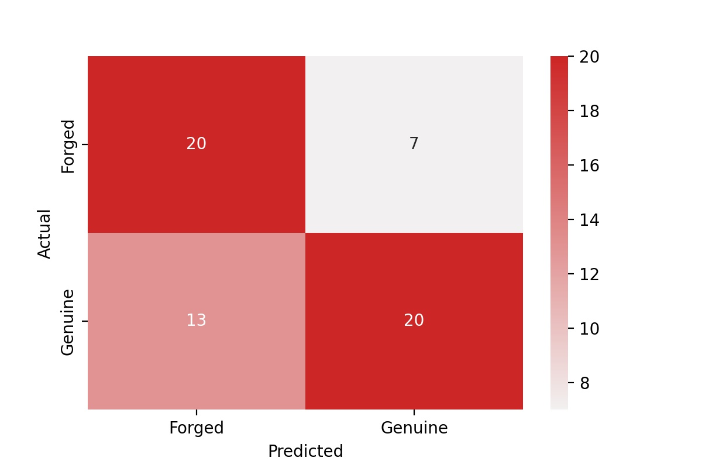

# Signature Classification

### Author 
Zachary Rauch: 
[LinkedIn](https://www.linkedin.com/in/zach-rauch/) |
[GitHub](https://github.com/ZachRauch)|
[Email](zach.rauch0@gmail.com)
## Overview
  The aim of this analysis is to identify fraudulent signatures in a dataset. My audience here is Wells Fargo's Fraud and Financial Crimes Department. Using just a small dataset with only 300 sample I was able to create a classification model to predict whether a signature is genuine or forged.

---
## Business Understanding 
  Currently institutions and businesses recognize signatures as the primary way of authenticating transactions. Signatures are used to sign checks, authorize documents and contracts, and validate credit card transactions. According to recent studies, check fraud costs banks about $900M a year with 22 percent of all fraudulent checks attributed to signature fraud. Therefore, creating an algorithm to identify signature fraud or flagging suspicious signatures for further investigation is a valuable asset.

---
## Data 
  The data was collected from kaggle [here](https://www.kaggle.com/datasets/divyanshrai/handwritten-signatures). The dataset contains just 300 samples of genuine and forged signatures from 30 people, of which 50 percent are genuine and 50 percent are forged. This is an ideal class balance when building and training a model, but it is a rather small sample size. To train the model more effectively, image augmentation was performed to raise the training dataset from 240 images up to 3,360 images. 

---
## Methodology
  I utilized Google colab to run my notebooks. The [colab_requirements](https://github.com/ZachRauch/Signature_Classification/blob/main/Data/colab_requirements.txt) are the package requirements the notebooks were run on. Using Google Colab significantly reduced runtime and allowed me to use newer versions of Tensorflow. However, I was still limited by my working memory. I used a Keras wrapper in order to utilize scikit learns cross validation to assist in evaluating each model. I also used metrics of loss and accuracy while fitting to aid in determining the final model. The metrics of loss and accuracy were recorded using a ModelCheckpoint that saved the weights of the best Epoch during fitting in regards to validation accuracy.

---
## Results
  Model3's cross-validation score was 55%. When fit the model's maximum validation accuracy was 57% with a binary cross-entropy loss of .69. This is the highest fitted validation accuracy and lowest loss score of all the models. Thus Model3 was selected to be the final model. When evaluated on the test data it accurately classified 67% of signatures.



  The confusion matrix above shows the counts of our predicted target variable against the actual target variable counts.


  More specifically, the model is accurate 74% of the time for Genuine signatures and 61% percent for Forged signatures.

---
## Conclusion
  With minimal data an accurate model was produced. With this model an app was developed as an example of how this model could be used. In addition with more data and resources this model could be improved. 

---
## Next Steps
- Gather More Data: The dataset used in this study had only 300 images to work with. With more data, a model may be able to detect other patterns for classifying genuine and forged signatures.
- More Complex Models: With more time and resources, training more complex or pretrain models may prove beneficial. Complex models take time and memory to run but can provide better results.
- Types of Signatures: Explore different types of signatures, for example electronic versus physical. Explore different types of forgeries, for example skilled versus blind.

---
## App Deployment
  An app was created based on the final model. The [app.py](https://github.com/ZachRauch/Signature_Classification/blob/main/app.py) file contains the script to run the app. The [requirements.txt](https://github.com/ZachRauch/Signature_Classification/blob/main/requirements.txt) file contains the packages required for the app to work through [streamlit](https://streamlit.io/). Click the link below and upload a png of a signature to test it out. 
[Try the app](https://share.streamlit.io/zachrauch/signature_classification/main/app.py)

---
## Direct Links
- [Presentation](https://github.com/ZachRauch/Signature_Classification/blob/main/Presentation.pdf)
- [Jupyter Notebook](https://github.com/ZachRauch/Signature_Classification/blob/main/Signature_Classification.ipynb)
---
## Repository Structure
```
├── Data 
├── Workspace
├── images
├── .gitignore
├── Presentation.pdf
├── READ.md
├── Signature_Classification.ipynb
├── app.py
└── requirements.txt
```
## Citations

- [Business Understanding](https://towardsdatascience.com/signature-fraud-detection-an-advanced-analytics-approach-a795b0e588b2)

- [Mobile Deposits](https://www.retaildive.com/ex/mobilecommercedaily/mobile-users-deposit-over-40-billion-in-checks-via-mobile-mitek#:~:text=%E2%80%9CAnalyst%20data%20shows%20that%20more,and%20convenient%2C%20it's%20fun.%E2%80%9D)

- [Data](https://www.kaggle.com/datasets/divyanshrai/handwritten-signatures)

Code References:

- [Image Augmentation](https://machinelearningmastery.com/how-to-configure-image-data-augmentation-when-training-deep-learning-neural-networks/)

- [VGG16 Reference](https://www.kaggle.com/code/raulcsimpetru/vgg16-binary-classification/notebook)

- [Keras Documentation](https://keras.io/api/)

Images:

- [Banner](https://www.adamsluka.com/forgery.html)

- [Wells Fargo Logo](https://upload.wikimedia.org/wikipedia/commons/thumb/b/b3/Wells_Fargo_Bank.svg/2048px-Wells_Fargo_Bank.svg.png)

- [Kaggle Logo](https://upload.wikimedia.org/wikipedia/commons/7/7c/Kaggle_logo.png)

Streamlit References: 

- [Streamlit](https://streamlit.io/)

- [How to Run Streamlit Apps From Colab](https://medium.com/@jcharistech/how-to-run-streamlit-apps-from-colab-29b969a1bdfc) 

- [Code reference](https://github.com/jingxianho/streamlit-local-tunnel/blob/main/Streamlit_local_tunnel.ipynb)

- [NGROK](https://dashboard.ngrok.com/get-started/setup)

- [st.file_uploader to array](https://discuss.streamlit.io/t/png-bytes-io-numpy-conversion-using-file-uploader/1409)
